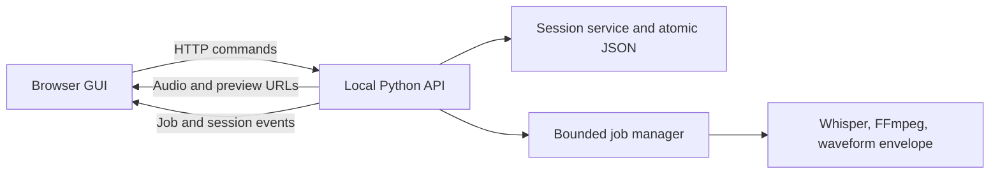

# Local web GUI porting plan

Prepared 2026-09-23. This plan proposes a native browser interface for clip review while retaining the existing Python audio pipeline. It is a plan, not an implementation or a commitment to deploy a public service.

Checkpoint 1 decisions (2026-09-24): keep saved clips missing from a changed SRT until explicitly removed; generate a new export filename when one exists; search within the selected status filter; undo recent marks, trims, and skips in the first GUI release.

Progress on 2026-09-24: Phase 0 safety fixes, the local API, and the Phase 2 review screen are implemented. Checkpoint 2 was reviewed using the disposable 0526 copy described in [the review handoff](web-review-checkpoint-2.md).

The checkpoint 2 follow-up established visible shortcut labels, status chips only in All, Trimmed chips beside duration in filtered views, and separate count pills on the filters. All three refinements are approved in [the follow-up checklist](web-review-ui-refinements.md), so checkpoint 3 can proceed.

Phase 3 now has bounded waveform windows, browser playback, overview and fine handle dragging, signed offsets, 10/100 ms nudges, and immediate revisioned saves. The Start and End fine views are stacked, nudge buttons show their shortcut keys, and the title and clip list stay fixed while timing controls scroll. [Checkpoint 3](web-review-checkpoint-3.md) is ready for owner listening and trim review before export behavior is finalized.

## Outcome and scope

The first release should let one person open an audio file, transcribe it when needed, review SRT candidates, adjust boundaries, listen, export clips, and resume without losing edits. It should make the current keyboard flow available alongside visible controls and direct waveform interaction.

**Default product boundary:** Run a Python server bound to localhost and open the GUI in the user's browser. Audio, SRT, session JSON, caches, and exported clips remain on the local machine. Keep the TUI command working during migration. Remote hosting, accounts, collaboration, and mobile editing are later decisions; the current MLX Whisper path is Mac-oriented.

The existing `jipandan-serve` command is a browser-hosted terminal. It should remain available during transition, but it is not the target GUI. Its `textual-serve` and xterm.js layer would not be reused as the application UI.

## Your review checkpoints

The owner will interrupt development at four planned points to inspect a concrete build or settle a product rule. The nontechnical tasks and feedback format are in [Your guide to reviewing the web GUI](your-web-gui-review-guide.md). Prepare a runnable build, a safe copy of test data, one launch instruction, and a short list of changes before each hands-on review. Do not ask the owner to inspect code or perform routine automated checks.

| Checkpoint | Place in this plan | Feedback needed before dependent work proceeds |
| --- | --- | --- |
| 1. Set the rules | Before Phase 0 changes settle persistence and export behavior | Decide how to handle removed SRT entries, existing export filenames, search scope, and expected undo behavior. |
| 2. Try the review screen | End of Phase 2, before the waveform UI is built on it | Confirm the list, filters, search, marking, rename, bulk actions, and reload flow work naturally. |
| 3. Try waveform editing | End of Phase 3, before export UI behavior is finalized | Confirm real clip boundaries can be found, heard, adjusted precisely, and saved. |
| 4. Finish a real session | End of Phase 4, before cutover decisions | Confirm transcription through final exported MP3 works on representative audio, including one failure and retry. |

Treat feedback at any point as a change request for the active phase: record the observation, fix material workflow or audio problems, and offer the same task again when ready. Continue independent engineering while waiting, but do not lock in a dependent interaction or switch the recommended interface before its checkpoint is resolved. This keeps the owner's involvement focused on decisions and lived use rather than every implementation step.

## Decisions to implement against

| Area | Proposed choice | Reason / boundary |
| --- | --- | --- |
| Frontend | React + TypeScript in `frontend/`, built with Vite; npm scripts and one npm lockfile | The review screen has interdependent playback, selection, filters, jobs, and edit state. TypeScript contracts help keep those states aligned with the API. |
| Styling | Tailwind CSS for layout and controls; focused CSS or canvas code for waveform geometry | Provides consistent responsive layout without forcing waveform rendering into utility classes. |
| Backend | A separate FastAPI app under `src/jipandan/web/`, using existing `core` modules | Typed HTTP contracts and a clean boundary from Textual widgets. Do not put business rules into routes. |
| Process model | One local server plus a bounded background job manager for FFmpeg and transcription | Long operations must outlive a request, expose progress and failure, and have controlled concurrency. Avoid treating heavyweight transcription as a short response background task. |
| Updates | HTTP for mutations; server-sent events for job/status updates, with reconnect and polling fallback | Most updates travel from server to browser. WebSockets are unnecessary for the initial single-user flow. |
| Persistence | One authoritative server-side session; atomic save after each accepted mutation; revision checks | A tab close must not discard the last edit, and stale tabs must not overwrite newer work. |
| Playback | Browser `<audio>` for ordinary source preview and rendered export preview | Gives native playback, seek, and volume controls. Export preview remains FFmpeg-rendered so the user hears the actual output. |

The stack choices are proposals. Vite supports a React TypeScript template; Tailwind has a Vite integration; FastAPI supports server-sent events. Check versions at implementation time rather than pinning them in this planning document. [Vite guide](https://vite.dev/guide/), [Tailwind Vite guide](https://tailwindcss.com/docs/installation), [FastAPI SSE guide](https://fastapi.tiangolo.com/tutorial/server-sent-events/).

## Reuse and separation

**Reuse:** `core.models.Session` and `ClipCandidate`, SRT parsing, FFmpeg export and probing, waveform envelope generation, and Whisper transcription. Move any behavior currently encoded only in Textual screens into framework-independent services. Keep the session JSON readable by the TUI during the transition.

**Replace:** Textual screens, key-binding dispatch, MPV playback in the GUI, terminal waveform widgets, and the xterm.js bridge. The browser gets its own components and controls. The Python backend remains responsible for authoritative clip bounds and export results.

## Complete user flow

### 1. Launch and open audio

- Add `uv run jipandan-web [audio_path]`. With a path, validate and open it directly with no copy. Without a path, show an **Open audio** page with recent local sessions and a browser file picker. Stream selected files into an app-managed location rather than reading a long recording into browser memory. An optional advanced local-path field can avoid copying large recordings; the server must validate it.
- Show the resolved audio filename, duration, detected SRT, session path, and export directory before review. Report missing audio or unavailable FFmpeg before starting a long job.
- If a saved session and SRT disagree, show a merge preview: added SRT entries, changed timing/text, removed indexes, and affected edited or duplicated clips. Do not mutate the session until the user selects how to proceed. Back up the pre-merge session before applying removals.
- If there is no SRT, present transcription settings with sensible defaults and a clear Start action. If an SRT exists and no session exists, create the session after validating the SRT.

Browsers can read files chosen by the user, but that is different from accessing any pathname on the machine. A local path supplied to the Python process remains the zero-copy option. [MDN File API guide](https://developer.mozilla.org/en-US/docs/Web/API/File_API/Using_files_from_web_applications).

### 2. Transcribe

- Show model, language, temperature, context, and threshold settings with field validation before starting. Keep the settings visible while the job runs.
- Show elapsed time, current phase, recent log output, failure reason, and Retry. Support Cancel if the underlying job can be stopped safely; otherwise label it Stop after current operation.
- Write SRT to a job-specific temporary file. Parse and validate it before an atomic replacement of the final SRT. A failed or interrupted job must not make a partial SRT look complete.
- On completion, present the number of entries and an **Open review** action. Preserve the log for inspection after failure.

### 3. Review and organize

- Use a two-pane desktop layout: a clip list on the left and waveform/player/details on the right. On narrow screens, use a list/detail view with a persistent Back control.
- Each list row shows clip index, title, status, duration, and whether its bounds differ from the SRT. The header shows visible count and counts by status.
- Filter chips for Unsorted, Group 1, Group 2, Exported, and All. Search narrows the selected filter; its scope is displayed beside the search box. “Hide processed” is explicit and independent.
- Keep next/previous clip, Group 1, Group 2, Skip, undo skip, duplicate, rename, jump to index, and bulk skip through current. Give bulk skip a confirmation with the exact affected count and an undo action.
- Keep keyboard shortcuts for experienced users, but do not trigger review shortcuts while a title or search input is active. Put shortcuts in a discoverable help panel and tooltips.
- Save each status/title/duplicate change on the server before treating it as committed. Show Saved, Saving, and Save failed states. Preserve the current filter and selected clip across reloads.

### 4. Listen and trim

- Draw a waveform from the server's existing envelope data. Render it in canvas or SVG with start/end handles, current playhead, time ticks, and a zoomed boundary view. Cache envelope resolutions keyed by audio identity and viewport.
- Let users drag handles for coarse changes, then use numeric signed offsets or the existing 100 ms and 10 ms nudge steps. Show original and current timestamps, offsets, and duration at all times. Enforce nonnegative start and a minimum positive duration in the server service.
- Support Play/Pause, seek, replay from start, and boundary audition. Use browser audio for source playback, but do not assume a seek is sample accurate: browser media seeking can land at a supported position. Verify final timing against the rendered export preview. [MDN `currentTime`](https://developer.mozilla.org/en-US/docs/Web/API/HTMLMediaElement/currentTime).
- Keep drag motion local for responsiveness; send the final accepted boundary on pointer release. Keyboard and numeric edits should save promptly. A failed save restores or clearly marks the unsaved value.

### 5. Preview and export

- Preserve As is, Trim edges, and Trim all modes, with start/stop threshold controls and explanations. Show the unprocessed duration, rendered duration, and difference.
- Each preview request captures a clip revision and exact export options. Give it a unique job directory and immutable output path. If the user changes options or clip bounds, mark the old preview stale and never publish it as the new selection.
- Play the rendered preview in the browser. Let the user edit the export title, replay, return to options, or confirm export. Display an actionable error if preview rendering fails; exporting without a preview should require a clear choice.
- Publish from the exact preview artifact, or re-render from the same captured revision and options. Write to a temporary destination and replace the final file only after success. If a filename already exists, show an explicit Replace / Choose another title decision.
- After completion, show the output path and an Open/Reveal action available in the local app context. Mark the clip Exported only after the file exists and the session save succeeds.

## API and state contracts

The following is a starting contract, not a requirement to mirror each route exactly:

| Endpoint | Purpose |
| --- | --- |
| `GET /api/session` | Audio metadata, session revision, candidates, counts, active jobs, and merge state |
| `POST /api/session/open` | Open an approved local path or completed upload |
| `GET /api/session/merge-preview` / `POST /api/session/merge` | Inspect and apply explicit SRT reconciliation |
| `PATCH /api/clips/{clip_id}` | Change status, title, or bounds using `expected_revision` |
| `POST /api/clips/{clip_id}/duplicate` | Duplicate a candidate |
| `POST /api/clips/bulk-skip` | Apply an explicit list of pending clip IDs; return changed IDs |
| `POST /api/transcriptions` | Start a transcription job |
| `POST /api/previews` | Render a preview for clip revision and export options |
| `POST /api/exports` | Publish a confirmed preview or start an export job |
| `GET /api/jobs/{job_id}` / `GET /api/events` | Job snapshot and progress stream |
| `GET /api/audio` / `GET /api/previews/{job_id}/audio` | Serve only the opened audio and authorized preview with seekable responses |
| `GET /api/waveforms/{clip_id}` | Return bounded envelope data for the requested resolution and viewport |

Use integer milliseconds or another exact unit in API payloads; format SRT timestamps only at file boundaries. Reject NaN, infinity, negative durations, and out-of-range trim values. Mutations should return the new session revision and canonical clip state. A stale revision returns a conflict plus current state so another tab cannot overwrite newer edits.

The Python service should own the shared operations: open/merge, status transitions and undo data, trim validation, duplication, preview job identity, export publication, and persistence. The TUI can call these same operations as it is refactored. Avoid copying the TUI controller's filtering behavior into the API; implement one documented filter rule and test it at the UI boundary.

## Persistence and job safety

1. Fix the six findings in [the TUI review](tui-user-flow-issues.md) in shared code where possible. In particular, do not build a web interface over the current automatic destructive merge or preview paths.
2. Write session JSON to a sibling temporary file, flush it, then atomically replace the target. Keep a backup before schema migration or accepted SRT removal. Migrate older session versions on a copy and retain the original until the new file is verified.
3. Serialize session mutations for one audio file. Include a monotonically increasing revision and reject stale edits. Handle a second browser tab and simultaneous TUI/web use deliberately: one writer or explicit conflict resolution.
4. Give every FFmpeg/Whisper job a unique ID, isolated working directory, captured inputs, and states `queued`, `running`, `completed`, `failed`, and `cancelled`. Limit concurrent CPU/media jobs. On server restart, mark interrupted jobs failed or restartable rather than leaving an indefinite spinner.
5. Never use the title alone as a cache key. Include source identity, clip ID and revision, mode, thresholds, and algorithm version. Validate that a cached artifact exists and matches its metadata before reuse.
6. Clean up failed and superseded temporary files after they are no longer referenced by an active export. Keep confirmed exports and session backups under an explicit retention policy.

## Implementation sequence and acceptance gates

### Phase 0 — Stabilize shared behavior

Fix the six review findings. Extract session mutations, merge proposal, and export preview identity into framework-independent functions or services. Add focused tests for destructive merge prevention, immediate persistence, bulk skip, filter/search composition, transcription retry state, and concurrent preview paths.

**Owner checkpoint 1:** Resolve the four behavior questions in the companion guide before implementing irreversible merge or overwrite behavior. Use the owner's typical and difficult recordings as later test cases, working from copies.

**Gate:** The TUI still performs its existing flow; the review's reproduced failures are gone; concurrent preview jobs cannot address the same working files; the chosen merge and overwrite rules are recorded.

### Phase 1 — Local API and session lifecycle

Add the local server command, validated audio opening, API schemas, revisioned mutations, atomic session writes, safe media serving, and merge preview. Keep the existing TUI and browser terminal commands.

**Gate:** API tests cover fresh SRT, existing session, modified SRT, missing files, invalid edits, stale revisions, and two simultaneous clients. Relaunch after any accepted edit returns the same state.

### Phase 2 — Review GUI

Set up `frontend/` with npm, Vite, React, TypeScript, and Tailwind. Build launch, list, status/filter/search, details, rename, duplicate, undo, and keyboard parity. Add Saved/Saving/Error feedback. Use the API as the sole source of persisted state.

**Owner checkpoint 2:** Give the owner a working review screen and let them classify a small set of real clips without coaching. Resolve blocking navigation, terminology, and save-state findings before building the waveform editor on this layout.

**Gate:** A user can finish the complete classification pass without the TUI. Browser tests cover keyboard focus, IME title entry, filter/search scope, bulk skip, reload, and narrow layout; the owner's material findings are addressed or explicitly tracked.

### Phase 3 — Waveform and playback

Serve source audio and envelope data. Build seek, playhead, coarse drag, fine boundary view, numeric offsets, and keyboard nudges. Keep visual state and audio state synchronized after clip selection changes.

**Owner checkpoint 3:** Have the owner trim difficult real clips with dragging, fine nudges, and listening. Resolve any mismatch between displayed boundaries, heard audio, and saved values before finalizing the export interaction.

**Gate:** Boundary operations are accurate to the stored millisecond unit, never create invalid durations, and survive immediate reload. Long recordings remain responsive without loading the full waveform into browser memory; the owner can reach the intended boundaries without falling back to the TUI.

### Phase 4 — Transcription and export jobs

Add transcription settings/progress/retry and the three export modes with isolated previews, rendered playback, title editing, publication, and file conflict handling. Add job event reconnect and interrupted-job recovery.

**Owner checkpoint 4:** Give the owner a safe end-to-end test session. Ask them to compare rendered previews with final MP3s and exercise a prepared failure and retry. Fix wrong-audio, lost-work, and blocked-flow findings before the cutover decision.

**Gate:** Fresh audio can go from transcription to exported clip in one browser session. Tests cover failed and retried transcription, option changes during rendering, simultaneous previews, export failure, and confirmation before replacing an existing output. The owner has listened to representative outputs and can complete the flow.

### Phase 5 — Parity, packaging, and cutover

Compare the GUI and TUI feature list against real recordings, verify macOS setup, document the new command, and package the built frontend with the Python app. Only change the README's recommended interface after the GUI meets the gates above. Retain `jipandan` and `jipandan-serve` while users migrate.

**Gate:** A fresh install can launch the GUI with one documented command; bundled assets load without a separate development server; TUI sessions open in the GUI without data loss; the same session format can still be read by the TUI or has a documented migration path. The owner agrees the GUI is ready to become the recommended interface.

## Testing and operational checks

- **Core:** Deterministic tests for merge proposals, atomic save recovery, trim invariants, status transitions, filenames, preview keys, and output conflict handling.
- **API:** Request/response tests for input validation, revisions, local path restrictions, job transitions, reconnect, and media seeking/range behavior.
- **Browser:** End-to-end tests for open → transcribe → review → trim → preview → export → reload, plus keyboard shortcuts, focused text inputs, IME composition, error/retry, and tab-close behavior.
- **Media:** Short fixtures with known speech and silence, plus at least one long recording for waveform and seeking performance. Compare the rendered preview with the exported file.
- **Compatibility:** Run the TUI smoke flow after shared-core changes; verify existing version-2 session JSON and SRT inputs.
- **Security:** Bind to loopback by default, reject cross-origin mutation requests, use a per-launch token or equivalent local request protection, validate all file paths, and never expose arbitrary filesystem reads. Reassess authentication before any non-local binding.

## Main risks and responses

| Risk | Response |
| --- | --- |
| Long source audio makes waveform and browser playback sluggish | Stream audio with seek support; serve downsampled envelope levels and only the visible viewport. |
| Browser seek differs from final FFmpeg cut | Use browser playback for review; require a rendered export preview for final timing decisions. |
| A second tab or the TUI overwrites newer work | Server-side revision checks and one-writer policy. |
| MLX transcription blocks or leaks global stdout state | Run it as an isolated managed job with captured logs and a clear restart policy. |
| A browser file picker copies a large local file | Preserve the CLI path launch and offer validated local-path opening as a zero-copy alternative. |
| Public hosting expands access to source recordings | Keep the first release on localhost; design upload, storage, authentication, and retention only if remote use becomes a requirement. |

## External references

- [Vite Getting Started](https://vite.dev/guide/) and [Tailwind with Vite](https://tailwindcss.com/docs/installation) for the proposed frontend setup.
- [FastAPI background task caveat](https://fastapi.tiangolo.com/tutorial/background-tasks/) and [FastAPI server-sent events](https://fastapi.tiangolo.com/tutorial/server-sent-events/) for job architecture choices.
- [MDN audio element](https://developer.mozilla.org/en-US/docs/Web/HTML/Reference/Elements/audio), [media seeking](https://developer.mozilla.org/en-US/docs/Web/API/HTMLMediaElement/currentTime), and [File API](https://developer.mozilla.org/en-US/docs/Web/API/File_API/Using_files_from_web_applications) for browser capabilities and limits.
