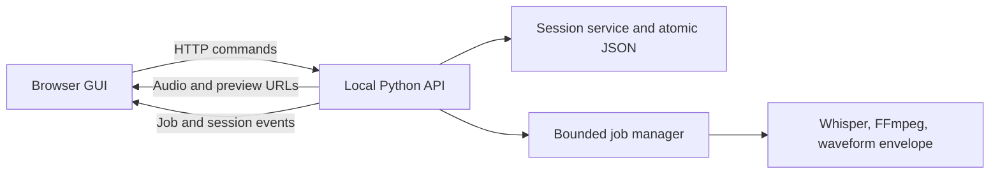

# Local web GUI porting plan

Build a local browser interface that can open audio, transcribe when needed, review and trim clips, and export MP3s without losing edits. Reuse the Python audio pipeline and keep the TUI available during migration.

**Current state:** Phases 0–4A and checkpoints 1–4 are complete. The owner approved the rendered preview flow. Phase 4B now has transcription jobs and final export publication in a review build; [checkpoint 5](web-review-checkpoint-5.md) is ready for end-to-end owner review. The [review guide](your-web-gui-review-guide.md) covers that hands-on checkpoint.

## Scope

Run a Python server bound to localhost and open the GUI in the browser. Audio, SRT, session JSON, caches, and exported clips remain on the local machine. Remote hosting, accounts, collaboration, and mobile editing are later decisions; the current MLX Whisper path is Mac-oriented.

The existing `jipandan-serve` command is a browser-hosted terminal. It should remain available during transition, but it is not the target GUI. Its `textual-serve` and xterm.js layer would not be reused as the application UI.

## Your review checkpoints

Each checkpoint needs a runnable build, safe test copy, one launch instruction, and a short list of changes. The tasks and feedback format are in [Your guide to reviewing the web GUI](your-web-gui-review-guide.md). Do not ask the owner to inspect code or perform routine automated checks.

| Checkpoint | Place in this plan | Feedback needed before dependent work proceeds |
| --- | --- | --- |
| 1. Set the rules | Before Phase 0 changes settle persistence and export behavior | Decide how to handle removed SRT entries, existing export filenames, search scope, and expected undo behavior. |
| 2. Try the review screen | End of Phase 2, before the waveform UI is built on it | Confirm the list, filters, search, marking, rename, bulk actions, and reload flow work naturally. |
| 3. Try waveform editing — complete | End of Phase 3 | The owner approved the listening and trim flow. |
| 4. Try rendered previews — complete | End of Phase 4A | The owner approved the rendered audio and interaction flow. |
| 5. Finish a real session | End of Phase 4B, before cutover decisions | Confirm transcription through final exported MP3 works on representative audio, including one failure and retry. |

Treat feedback at any point as a change request for the active phase: record the observation, fix material workflow or audio problems, and offer the same task again when ready. Continue independent engineering while waiting, but do not lock in a dependent interaction or switch the recommended interface before its checkpoint is resolved. This keeps the owner's involvement focused on decisions and lived use rather than every implementation step.

## Decisions to implement against

**Settled product rules:** Keep saved clips missing from a changed SRT until explicitly removed; automatically choose a new filename on export collision; search within the selected filter; and undo recent marks, trims, and skips from one Undo action.

**Interaction rule for remaining screens:** Show keyboard shortcuts on their buttons, show status and counts only where they help a decision, place each action once beside its task, and avoid nested decorative panels or duplicate controls. Keep the clip list and title steady while long detail content scrolls. The review and trimming sections below record the approved specifics.

| Area | Proposed choice | Reason / boundary |
| --- | --- | --- |
| Frontend | React + TypeScript in `frontend/`, built with Vite; npm scripts and one npm lockfile | The review screen has interdependent playback, selection, filters, jobs, and edit state. TypeScript contracts help keep those states aligned with the API. |
| Styling | Tailwind CSS for layout and controls; focused CSS or canvas code for waveform geometry | Provides consistent responsive layout without forcing waveform rendering into utility classes. |
| Backend | A separate FastAPI app under `src/jipandan/web/`, using existing `core` modules | Typed HTTP contracts and a clean boundary from Textual widgets. Do not put business rules into routes. |
| Process model | One local server plus a bounded background job manager for FFmpeg and transcription | Long operations must outlive a request, expose progress and failure, and have controlled concurrency. Avoid treating heavyweight transcription as a short response background task. |
| Updates | HTTP for mutations; server-sent events for job/status updates, with reconnect and polling fallback | Most updates travel from server to browser. WebSockets are unnecessary for the initial single-user flow. |
| Persistence | One authoritative server-side session; atomic save after each accepted mutation; revision checks | A tab close must not discard the last edit, and stale tabs must not overwrite newer work. |
| Playback | Browser `<audio>` for source and rendered export audio, with task-specific visible controls | Source seek comes from clicking the waveform; export preview plays FFmpeg-rendered audio so the user hears the actual output. |

The stack choices are proposals. Vite supports a React TypeScript template; Tailwind has a Vite integration; FastAPI supports server-sent events. Check versions at implementation time rather than pinning them in this planning document. [Vite guide](https://vite.dev/guide/), [Tailwind Vite guide](https://tailwindcss.com/docs/installation), [FastAPI SSE guide](https://fastapi.tiangolo.com/tutorial/server-sent-events/).

## Reuse and separation

**Reuse:** `core.models.Session` and `ClipCandidate`, SRT parsing, FFmpeg export and probing, waveform envelope generation, and Whisper transcription. Move any behavior currently encoded only in Textual screens into framework-independent services. Keep the session JSON readable by the TUI during the transition.

**Replace:** Textual screens, key-binding dispatch, MPV playback in the GUI, terminal waveform widgets, and the xterm.js bridge. The browser gets its own components and controls. The Python backend remains responsible for authoritative clip bounds and export results.

## Complete user flow

### 1. Launch and open audio

- Add `uv run jipandan-web [audio_path]`. With a path, validate and open it directly with no copy. Without a path, show an **Open audio** page with recent local sessions and a browser file picker. Stream selected files into an app-managed location rather than reading a long recording into browser memory. An optional advanced local-path field can avoid copying large recordings; the server must validate it.
- Show the resolved audio filename, duration, detected SRT, session path, and export directory before review. Report missing audio or unavailable FFmpeg before starting a long job.
- If a saved session and SRT disagree, show a merge preview: added SRT entries, changed timing/text, removed indexes, and affected edited or duplicated clips. Do not mutate the session until the user selects how to proceed. Back up the pre-merge session before applying removals.
- If there is no SRT, present transcription settings with sensible defaults and a clear Start action. If an SRT exists and no session exists, create the session after validating the SRT.

Browsers can read files chosen by the user, but that is different from accessing any pathname on the machine. A local path supplied to the Python process remains the zero-copy option. [MDN File API guide](https://developer.mozilla.org/en-US/docs/Web/API/File_API/Using_files_from_web_applications).

### 2. Transcribe

- Show model, language, temperature, context, and threshold settings with field validation before starting. Keep the settings visible while the job runs.
- Show elapsed time, current phase, recent log output, failure reason, and Retry. Support Cancel if the underlying job can be stopped safely; otherwise label it Stop after current operation.
- Keep the settings, active job status, and retry action in one clear work area. Show status where it changes the next decision; avoid repeated status badges or nested cards around every setting.
- Write SRT to a job-specific temporary file. Parse and validate it before an atomic replacement of the final SRT. A failed or interrupted job must not make a partial SRT look complete.
- On completion, present the number of entries and an **Open review** action. Preserve the log for inspection after failure.

### 3. Review and organize

- Use a two-pane desktop layout: a clip list on the left and waveform/player/details on the right. On narrow screens, use a list/detail view with a persistent Back control.
- Each list row shows clip index, title, and duration. All shows a status chip; filtered views omit that redundant status and show a restrained Trimmed chip beside duration only when needed. Keep the same row height either way. The header shows visible count and separate count pills on status filters.
- Filter buttons for Unsorted, Group 1, Group 2, Exported, and All. Search narrows the selected filter; its scope is clear in the search field. “Hide processed” is explicit and independent.
- Keep next/previous clip, Group 1, Group 2, Skip, duplicate, rename, jump to index, and bulk skip through selected. Put one Undo in the header; put bulk skip with list controls and confirm the exact affected count and scope.
- Keep keyboard shortcuts for experienced users, but do not trigger review shortcuts while a title or search input is active. Show the key on each relevant button, with a complete help dialog as backup.
- Save each status/title/duplicate change on the server before treating it as committed. Show Saved, Saving, and Save failed states. Preserve the current filter and selected clip across reloads.
- Keep the list and selected clip title stationary while the long detail controls scroll independently.

### 4. Listen and trim

- Draw a waveform from the server's existing envelope data. Render separate Overview and Fine panels with the same background and border, without a containing waveform card. Fine shows Start above End; each has its own handle, nudge buttons, and signed offset. Cache envelope resolutions keyed by audio identity and viewport.
- Let users drag handles for coarse changes, then use numeric signed offsets or 100 ms and 10 ms nudge steps. Put the shortcut badge on each nudge button. Show original and current timestamps, offsets, and duration where the fine adjustment happens. Enforce nonnegative start and a minimum positive duration in the server service.
- Put Play/Pause, Replay, and boundary audition immediately below Classification. Click a waveform to place the playhead; do not add a second seek slider. Use browser audio for source playback, but do not assume a seek is sample accurate: browser media seeking can land at a supported position. Verify final timing against the rendered export preview. [MDN `currentTime`](https://developer.mozilla.org/en-US/docs/Web/API/HTMLMediaElement/currentTime).
- Keep drag motion local for responsiveness; send the final accepted boundary on pointer release. Keyboard and numeric edits should save promptly. A failed save restores or clearly marks the unsaved value.

### 5. Preview and export

- Preserve As is, Trim edges, and Trim all modes, with start/stop threshold controls and explanations. Show the unprocessed duration, rendered duration, and difference.
- Each preview request captures a clip revision and exact export options. Give it a unique job directory and immutable output path. If the user changes options or clip bounds, mark the old preview stale and never publish it as the new selection.
- Use `E` to open the export modal. When a clip enters Group 1 or Group 2, queue the default Trim edges render in the background and persist its MP3 and waveform on disk. Key cached data by the source audio identity, clip timing/title, and exact render options so later edits cannot reuse the wrong result.
- On modal open, reuse a matching cached render immediately or start one automatically. Show vertically stacked, playable waveforms for the unchanged clip and export candidate. Keep both areas at a fixed height while rendering.
- Keep options, render state, playback, and export controls in a shallow sequence of peer sections. Each action should sit with the options or result it affects; show any keyboard shortcut on the button. Avoid duplicate progress displays and controls that repeat an interaction already available in the preview player.
- Play both versions in the browser. Update the candidate automatically when a mode, threshold, or export title changes. Display an actionable error if preview rendering fails; exporting without a preview should require a clear choice. Show when the preview is stale after an edit.
- Publish from the exact preview artifact, or re-render from the same captured revision and options. Write to a temporary destination and move the final file into place only after success. If a filename already exists, automatically choose a new filename without replacing the existing MP3; show the proposed name before export and the actual path afterward.
- After completion, show the output path and an Open/Reveal action available in the local app context. Mark the clip Exported only after the file exists and the session save succeeds.

## API and state contracts

The following is a starting contract, not a requirement to mirror each route exactly:

| Endpoint | Purpose |
| --- | --- |
| `GET /api/session` | Audio metadata, session revision, candidates, counts, active jobs, and merge state |
| `POST /api/session/open` | Open an approved local path or completed upload |
| `GET /api/session/merge-preview` / `POST /api/session/merge` | Inspect and apply explicit SRT reconciliation |
| `PATCH /api/clips/{clip_id}` | Change status, title, or bounds using `expected_revision` |
| `POST /api/clips/{clip_id}/duplicate` | Duplicate a candidate |
| `POST /api/clips/bulk-skip` | Apply an explicit list of pending clip IDs; return changed IDs |
| `POST /api/transcriptions` | Start a transcription job |
| `POST /api/previews` | Render a preview for clip revision and export options |
| `POST /api/exports` | Publish a confirmed preview or start an export job |
| `GET /api/jobs/{job_id}` / `GET /api/events` | Job snapshot and progress stream |
| `GET /api/audio` / `GET /api/previews/{job_id}/audio` | Serve only the opened audio and authorized preview with seekable responses |
| `GET /api/waveforms/{clip_id}` | Return bounded envelope data for the requested resolution and viewport |

Use integer milliseconds or another exact unit in API payloads; format SRT timestamps only at file boundaries. Reject NaN, infinity, negative durations, and out-of-range trim values. Mutations should return the new session revision and canonical clip state. A stale revision returns a conflict plus current state so another tab cannot overwrite newer edits.

The Python service should own the shared operations: open/merge, status transitions and undo data, trim validation, duplication, preview job identity, export publication, and persistence. The TUI can call these same operations as it is refactored. Avoid copying the TUI controller's filtering behavior into the API; implement one documented filter rule and test it at the UI boundary.

## Persistence and job safety

1. Fix the six findings in [the TUI review](tui-user-flow-issues.md) in shared code where possible. In particular, do not build a web interface over the current automatic destructive merge or preview paths.
2. Write session JSON to a sibling temporary file, flush it, then atomically replace the target. Keep a backup before schema migration or accepted SRT removal. Migrate older session versions on a copy and retain the original until the new file is verified.
3. Serialize session mutations for one audio file. Include a monotonically increasing revision and reject stale edits. Handle a second browser tab and simultaneous TUI/web use deliberately: one writer or explicit conflict resolution.
4. Give every FFmpeg/Whisper job a unique ID, isolated working directory, captured inputs, and states `queued`, `running`, `completed`, `failed`, and `cancelled`. Limit concurrent CPU/media jobs. On server restart, mark interrupted jobs failed or restartable rather than leaving an indefinite spinner.
5. Never use the title alone as a cache key. Include source identity, clip ID and revision, mode, thresholds, and algorithm version. Validate that a cached artifact exists and matches its metadata before reuse.
6. Clean up failed and superseded temporary files after they are no longer referenced by an active export. Keep confirmed exports and session backups under an explicit retention policy.

## Implementation sequence and acceptance gates

### Phase 0 — Stabilize shared behavior

Fix the six review findings. Extract session mutations, merge proposal, and export preview identity into framework-independent functions or services. Add focused tests for destructive merge prevention, immediate persistence, bulk skip, filter/search composition, transcription retry state, and concurrent preview paths.

**Owner checkpoint 1 — complete:** The four behavior decisions are recorded above. Use the owner's typical recording and difficult clips as later test cases, working from copies.

**Gate:** The TUI still performs its existing flow; the review's reproduced failures are gone; concurrent preview jobs cannot address the same working files; the chosen merge and filename-collision rules are recorded.

### Phase 1 — Local API and session lifecycle

Add the local server command, validated audio opening, API schemas, revisioned mutations, atomic session writes, safe media serving, and merge preview. Keep the existing TUI and browser terminal commands.

**Gate:** API tests cover fresh SRT, existing session, modified SRT, missing files, invalid edits, stale revisions, and two simultaneous clients. Relaunch after any accepted edit returns the same state.

### Phase 2 — Review GUI

Set up `frontend/` with npm, Vite, React, TypeScript, and Tailwind. Build launch, list, status/filter/search, details, rename, duplicate, undo, and keyboard parity. Add Saved/Saving/Error feedback. Use the API as the sole source of persisted state.

**Owner checkpoint 2 — complete:** The owner classified real clips and refined shortcut labels, contextual chips, and filter counts. Those choices are now part of the interaction rule and review requirements above.

**Gate:** A user can finish the complete classification pass without the TUI. Browser tests cover keyboard focus, IME title entry, filter/search scope, bulk skip, reload, and narrow layout; the owner's material findings are addressed or explicitly tracked.

### Phase 3 — Waveform and playback

Serve source audio and envelope data. Build seek, playhead, coarse drag, fine boundary view, numeric offsets, and keyboard nudges. Keep visual state and audio state synchronized after clip selection changes.

**Owner checkpoint 3 — complete:** The owner approved the waveform and playback flow after reviewing the [checkpoint 3 build](web-review-checkpoint-3.md).

**Gate:** Boundary operations are accurate to the stored millisecond unit, never create invalid durations, and survive immediate reload. Long recordings remain responsive without loading the full waveform into browser memory; the owner can reach the intended boundaries without falling back to the TUI.

### Phase 4A — Export options and rendered preview

After checkpoint 3's material waveform findings are resolved, build the three export modes, threshold controls, captured option/revision identity, isolated preview jobs, rendered playback, title editing, stale-preview handling, and useful failure states. Group 1 and Group 2 changes also queue the default render into a persistent disk cache. Opening the modal reuses a cache hit or starts the selected render automatically. Two fixed-size, playable waveforms compare the unchanged clip with the export candidate, and settings changes update the candidate automatically. Keep the preview UI focused, with visible action keys and no duplicate player controls. This phase must not publish final MP3s through an unreviewed flow.

**Owner checkpoint 4 — complete:** The owner reviewed the rendered preview build and reported that it was all good. The two waveforms, background rendering, mode controls, title, filename, and error flow remain the basis for final publication.

**Gate:** Preview jobs for different clips or options cannot collide; a changed option invalidates the old preview; matching disk cache is reused; a missing cache starts automatically; background renders are queued when clips are grouped; waveform display does not shift the layout; rendered audio corresponds to the displayed options and captured clip revision. The owner can choose a mode, find its controls and any shortcut at a glance, understand the result without TUI guidance, and identify the single next action.

### Phase 4B — Transcription and final export

After checkpoint 4's material findings are resolved, add transcription settings/progress/retry, final export publication from the reviewed preview state, automatic collision-free filenames, output reveal, job event reconnect, and interrupted-job recovery. Keep a single clear job status and retry action in context. Before publishing, show the proposed output name and directory; after publishing, show the actual result. An existing MP3 must remain untouched.

**Owner checkpoint 5:** Give the owner a safe end-to-end copy of the typical 0526 session and any difficult example they provide. Ask them to compare rendered previews with final MP3s, exercise a prepared failure and retry, verify automatic new naming on a collision, reopen the session, and judge whether they would use the GUI for the next real session. Fix wrong-audio, lost-work, and blocked-flow findings and repeat this checkpoint as needed before cutover.

**Gate:** Fresh audio can go from transcription to exported clip in one browser session. Tests cover failed and retried transcription, option changes during rendering, simultaneous previews, export failure, automatic filename collision handling without overwrite, and recovery after reload. The owner has listened to representative outputs and can complete the flow.

### Phase 5 — Packaging and cutover

Evaluate the GUI against the owner's real workflow and recordings, verify macOS setup, document the new command, and package the built frontend with the Python app. Feature parity with the TUI is not a requirement; document any deliberate differences that matter to a user choosing an interface. Only change the README's recommended interface after the GUI meets the gates above. Retain `jipandan` and `jipandan-serve` while users migrate.

**Gate:** A fresh install can launch the GUI with one documented command; bundled assets load without a separate development server; existing TUI sessions open in the GUI without data loss; the same session format can still be read by the TUI or has a documented migration path. The final interface follows the interaction rule above across review, transcription, and export. The checkpoint 5 review supports making the GUI the recommended interface; retain the TUI otherwise.

## Testing and operational checks

- **Core:** Deterministic tests for merge proposals, atomic save recovery, trim invariants, status transitions, automatic unique filenames, preview keys, and output conflict handling.
- **API:** Request/response tests for input validation, revisions, local path restrictions, job transitions, reconnect, and media seeking/range behavior.
- **Browser:** End-to-end tests for open → transcribe → review → trim → preview → export → reload, plus keyboard shortcuts, focused text inputs, IME composition, error/retry, and tab-close behavior.
- **Media:** Short fixtures with known speech and silence, plus at least one long recording for waveform and seeking performance. Compare the rendered preview with the exported file.
- **Compatibility:** Run the TUI smoke flow after shared-core changes; verify existing version-2 session JSON and SRT inputs.
- **Security:** Bind to loopback by default, reject cross-origin mutation requests, use a per-launch token or equivalent local request protection, validate all file paths, and never expose arbitrary filesystem reads. Reassess authentication before any non-local binding.

## Main risks and responses

| Risk | Response |
| --- | --- |
| Long source audio makes waveform and browser playback sluggish | Stream audio with seek support; serve downsampled envelope levels and only the visible viewport. |
| Browser seek differs from final FFmpeg cut | Use browser playback for review; require a rendered export preview for final timing decisions. |
| A second tab or the TUI overwrites newer work | Server-side revision checks and one-writer policy. |
| MLX transcription blocks or leaks global stdout state | Run it as an isolated managed job with captured logs and a clear restart policy. |
| A browser file picker copies a large local file | Preserve the CLI path launch and offer validated local-path opening as a zero-copy alternative. |
| Public hosting expands access to source recordings | Keep the first release on localhost; design upload, storage, authentication, and retention only if remote use becomes a requirement. |

## External references

- [Vite Getting Started](https://vite.dev/guide/) and [Tailwind with Vite](https://tailwindcss.com/docs/installation) for the proposed frontend setup.
- [FastAPI background task caveat](https://fastapi.tiangolo.com/tutorial/background-tasks/) and [FastAPI server-sent events](https://fastapi.tiangolo.com/tutorial/server-sent-events/) for job architecture choices.
- [MDN audio element](https://developer.mozilla.org/en-US/docs/Web/HTML/Reference/Elements/audio), [media seeking](https://developer.mozilla.org/en-US/docs/Web/API/HTMLMediaElement/currentTime), and [File API](https://developer.mozilla.org/en-US/docs/Web/API/File_API/Using_files_from_web_applications) for browser capabilities and limits.
